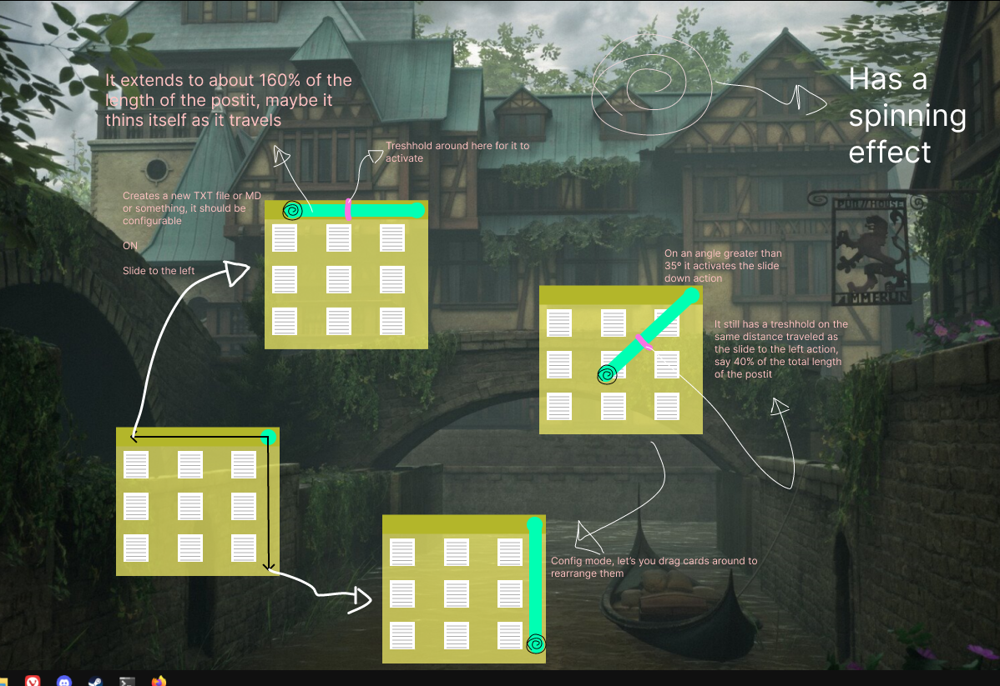

# Orrery-file
Little cross-platform test app for managing notes.Built 100% with Go and Fyne!

Are you a messy and unorganized person? have you ever needed to take some notes really quickly
during a meeting and you can never be bothered to organize them later? then this is for you!

This application is intented for creating and opening files in pre-configured directories through a rich, user friendly mouse focused interface

*A little doodle of what the finished app is going to look like*

### Planned features
<ul>
    <li>Mouse gestures for creating files and opening configuration windows</li>
    <li>Customizable backgrounds</li>
    <li>Shared theme between OS and the app</li>
    <li>Sync with multiple devices</li>
</ul>